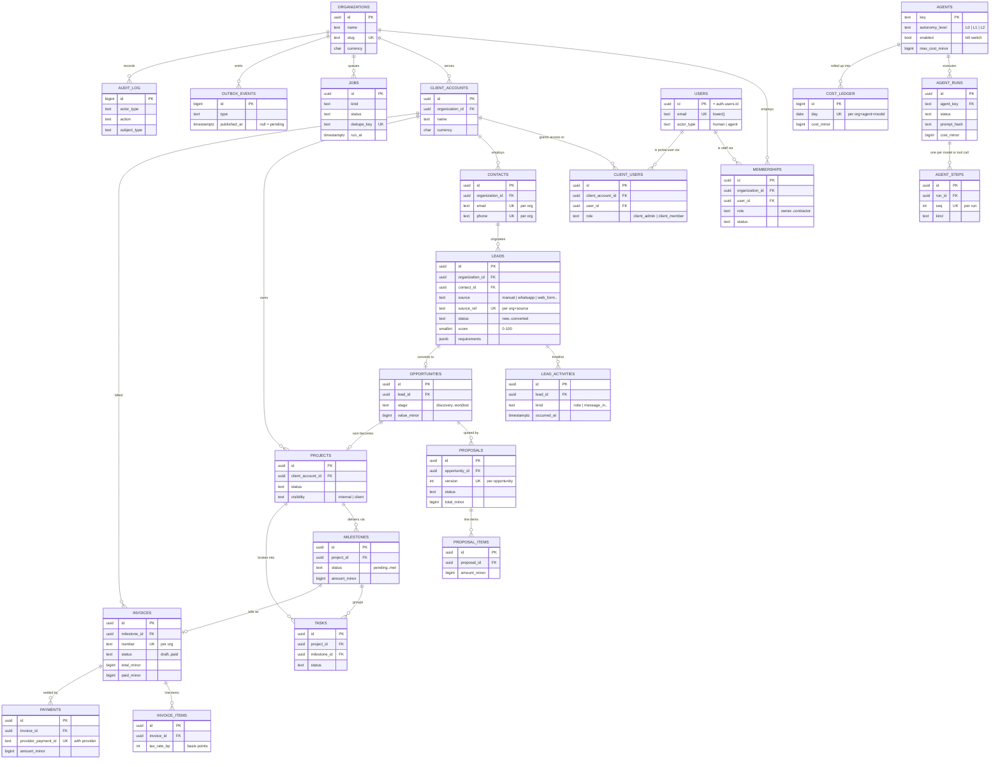

# Database

Postgres on Supabase. One database, one schema per module, Row Level Security
on every table.

Architecture rationale lives in [ARCHITECTURE.md §4](../../ARCHITECTURE.md).
This document is the working reference: what exists, why it is shaped that way,
and how to change it safely.

## Schemas

| Schema | Owns | Client-visible? |
| --- | --- | --- |
| `core` | organizations, users, memberships, client accounts, portal users, jobs, outbox | Partially |
| `audit` | append-only audit trail | No |
| `crm` | contacts, leads, lead activities | No |
| `sales` | opportunities, proposals, proposal items | No |
| `projects` | projects, milestones, tasks | Projects + milestones, when marked |
| `finance` | invoices, invoice items, payments | Issued invoices only |
| `ai` | agent registry, runs, steps, cost ledger | No |

A schema is a real ownership boundary, not a naming convention: each is granted
separately, and no module writes another module's tables. That is what makes
extracting a module later a deployment change rather than a rewrite.

## Entity relationships



The path from work to money runs
`MILESTONES → INVOICES → PAYMENTS`: a milestone reaching `met` is what makes an
invoice issuable. That chain is the reason `milestones.amount_minor` exists on
the delivery side rather than only in `finance`.

## Multi-tenancy

Every tenant-owned table carries `organization_id uuid not null` referencing
`core.organizations`, from migration 001. V1 runs a single organization, but the
column and its policies exist everywhere, so going multi-tenant is a signup
flow rather than a data-layer rewrite.

`core.users` is the deliberate exception. It mirrors `auth.users` and has no
`organization_id`, because membership is a many-to-many join — a user can
belong to more than one organization later without duplication.

### How a request is scoped

Tenancy is read from the **verified JWT**, never from request data:

```sql
organization_id = (select core.current_organization_id())
```

`core.current_organization_id()` reads `app_metadata.organization_id` from
`auth.jwt()`. The client cannot forge it. Companion accessors:

| Function | Returns |
| --- | --- |
| `core.current_organization_id()` | tenant id, or NULL |
| `core.current_user_role()` | `owner`, `ops_admin`, …, `client_member` |
| `core.current_client_account_id()` | portal user's account scope |
| `core.is_internal()` / `core.is_client()` | audience predicates |
| `core.can_write()` | roles permitted to mutate operational data |
| `core.is_owner()` | owner-only gates (money, agent config) |

> **Until Feature 3 lands, these return NULL and every policy denies.** That is
> the correct failure direction: a schema with no authentication yet should
> expose nothing. `scripts/verify-schema.mjs` asserts exactly this.

### Two performance and correctness traps

1. **Always wrap accessors in `(select …)`.** Postgres then evaluates them once
   per query as an InitPlan instead of once per row. Without the wrapper these
   policies become a per-row function call and scans degrade badly as tables
   grow.
2. **`core.shares_organization()` is `SECURITY DEFINER` on purpose.** The policy
   on `core.users` needs to read `core.memberships`, whose own policy would
   then be evaluated, recursing. Running the lookup with definer rights
   bypasses RLS on `memberships` and breaks the cycle. It returns only a
   boolean, so no rows leak.

## Conventions

| Concern | Rule |
| --- | --- |
| Money | `BIGINT` minor units (paise/cents) + `char(3)` ISO currency. Never float. |
| Tax rates | Basis points as `int` (`1800` = 18% GST), so rates never round. |
| Time | `timestamptz` always. Dates that are genuinely dates use `date`. |
| Enums | `text` + `CHECK`, not Postgres enums — adding a value is a one-line migration rather than a type alteration. |
| Primary keys | `uuid` + `gen_random_uuid()`, except high-volume append-only logs which use `bigserial`. |
| Soft delete | `deleted_at` only where recovery matters (leads, projects). Everything else is hard delete or immutable. |
| `updated_at` | Maintained by the shared `core.set_updated_at()` trigger, never by application code. |
| Idempotency | Enforced by unique indexes (`jobs.dedupe_key`, `payments(provider, provider_payment_id)`, `leads(organization_id, source, source_ref)`), because the database is the only reliable arbiter under concurrency. |

## Platform tables

**`core.jobs`** — the durable queue. Vercel has no always-on worker, so every
slow operation runs here (ARCHITECTURE §0.4). Claimed via
`core.claim_jobs(worker_id, batch_size)`, which uses `FOR UPDATE SKIP LOCKED`
so two concurrent invocations cannot claim the same job.
`core.reap_stalled_jobs()` releases work whose invocation was killed mid-run and
parks anything past `max_attempts` as `dead`.

**`core.outbox_events`** — the transactional outbox. Events are written in the
same transaction as the state change they describe, so "state committed but
event lost" cannot happen.

**`audit.audit_log`** — append-only, enforced twice: no `UPDATE`/`DELETE`
policy exists, and a trigger raises on either. The insert policy additionally
requires `actor_id = auth.uid()`, so a user cannot attribute an action to
someone else.

## Migrations

Plain SQL in `supabase/migrations/`, numbered, **forward-only**.

```bash
npm run db:push      # apply pending migrations to the linked project
npm run db:types     # regenerate src/lib/db/types.ts  (run after every push)
npm run db:verify    # tables exist, RLS denies, seed present
```

Rules:

- **Never edit a merged migration.** Write a new one.
- **Every migration must be idempotent** — `create … if not exists`,
  `create or replace function`, and `drop policy if exists` before
  `create policy`. Re-running a migration must be a no-op, not an error.
- **Destructive changes take two deploys**: add and backfill first, drop later.
  The old and new application versions are briefly live together.
- **Regenerate types after every push.** A stale `src/lib/db/types.ts` produces
  type errors that look like application bugs.

### Adding a table checklist

1. `organization_id uuid not null references core.organizations(id) on delete cascade`
2. Indexes on `organization_id` and any foreign key
3. `alter table … enable row level security`
4. A `select` policy and a write policy, using `(select core.…())`
5. `set_updated_at` trigger if the table has `updated_at`
6. Add it to `EXPECTED` in `scripts/verify-schema.mjs`

## Exposed schemas

PostgREST only serves schemas on the project's exposed list. After adding a
schema, add it under **Project Settings → API → Exposed schemas**, or queries
fail with `PGRST106`. Non-`public` schemas are addressed explicitly from the
client:

```ts
await supabase.schema('crm').from('leads').select('*');
```

## Seed data

`supabase/seed.sql` is idempotent (fixed UUIDs + `ON CONFLICT DO NOTHING`) and
creates one organization, two client accounts, three contacts, four leads —
one per pipeline state, so every UI branch has data — an activity timeline, and
the agent registry.

It deliberately creates **no auth users**. Identities belong to Supabase Auth
and are created by the flows in Feature 3; fabricating `auth.users` rows here
would drift from whatever those flows actually produce. Every user reference in
the seed is therefore null.
